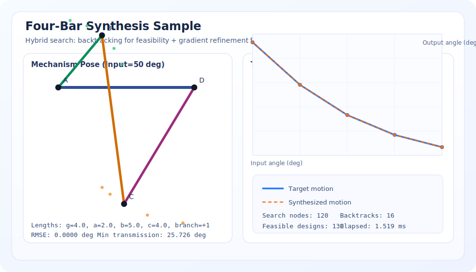

# Backtracking Lab

Modern backtracking toolkit with a flagship application in classical mechanism
design: **four-bar linkage synthesis**.

## Sample Result



This image is generated from the solver output and shows:
- a synthesized linkage pose
- motion curve fit (target vs synthesized)
- search metrics (nodes, backtracks, feasible designs, runtime)

## Core Application: Mechanism and Linkage Synthesis

This project solves the classic kinematics problem:

- design a planar four-bar mechanism
- hit target output positions for chosen input angles
- avoid near-singular transmission configurations
- respect geometric feasibility constraints

### Hybrid Method (Backtracking + Backprop-Style Refinement)

1. **Backtracking search**
   - discretizes link lengths (`ground`, `crank`, `coupler`, `rocker`)
   - assigns lengths step by step
   - prunes partial designs early when triangle/mobility constraints fail
2. **Gradient refinement**
   - takes top feasible candidates
   - minimizes output-angle error with finite-difference gradients
   - tunes continuous lengths and phase offset

This combines systematic feasibility exploration with continuous error
minimization.

## Quick Start

```bash
python main.py linkage \
  --input-angles 20,35,50,65,80 \
  --target-angles 265.205,249.848,238.915,231.748,227.327 \
  --ground-range 3:6:0.5 \
  --crank-range 1:3:0.5 \
  --coupler-range 4:6:0.5 \
  --rocker-range 3:5:0.5 \
  --top-k 5
```

Use `--json` for machine-readable output.

## Other Commands

- `python main.py nqueens --size 8 --max-solutions 5`
- `python main.py sudoku --puzzle "<81-char puzzle>"`
- `python main.py benchmark --sizes 8 10 12 --max-solutions 3`

## Development

Run tests:

```bash
python -m unittest discover -s tests -v
```

## Project Layout

```text
backtracking_lab/
  cli.py
  linkage.py
  metrics.py
  nqueens.py
  sudoku.py
tests/
main.py
```
